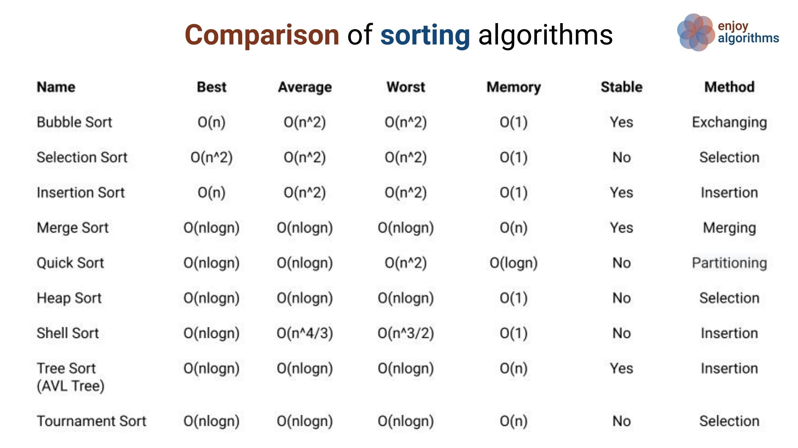

```
> #h1
> #h2
> ...
> *in đậm*
> **bôi đậm*
> ***in nghiêng và bôi đậm***
> `thêm code`
> [title](link//anh)
> gạch đầu dòng:
	> *
	> *
	> *
	> hoặc
	> 1.
	> 2.
	> 3.
> gạch kẻ ***
> highlight text >
> \
> {@youtube: Youtube ID or url}
```

## Các lý thuyết tổng hợp

**Độ phức tạp** là gì?
> Độ phức tạp thuật toán là định lượng tương đối thể hiện **số phép toán** của giải thuật so với kích thước của đầu vào.

**Độ ổn định(stable)** là gì?
> Độ ổn định của thuật toán là **đảm bảo thứ tự ban đầu** của dữ liệu đầu vào sau khi sắp xếp



Phân loại dựa trên **phương pháp**

* Cách tiếp cận ***chia để trị***: merge sort và quicksort
* Cách tiếp cận gia tăng việc sử dụng các ***vòng lặp lồng nhau***:  bucket sort, selection sort, insertion sort.
* Giải quyết vấn đề bằng cách sử dụng ***cấu trúc dữ liệu***: heapsort, tree sort
* Giải quyết vấn đề bằng cách sử dụng ***băm***: counting sort


***
## Giải thuật sắp xếp selectionsort
***

## Giải thuật sắp xếp bubblesort
1.Lý thuyết
> **Sắp xếp nổi bọt** được tiến hành dựa trên việc **so sánh cặp phần tử liền kề nhau và tráo đổi thứ tự** nếu chúng không theo thứ tự.

2.Minh họa


3.Độ phức tạp
> Độ phức tạp thời gian của trường hợp ***xấu nhất và trung bình***: **O (n * n)**. Trường hợp xấu nhất xảy ra **khi mảng được sắp xếp ngược lại**.

> Độ phức tạp về thời gian của trường hợp ***tốt nhất***: **O (n)**. Trường hợp tốt nhất xảy ra **khi mảng đã được sắp xếp**.

4.code
* thuật toán cơ bản
```
void bubbleSort(int arr[], int lengthOfArr)  
{  
    int i, j;  
    for (i = 0; i < lengthOfArr-1; i++)
	    // Last i elements are already in place  
	    for (j = 0; j < lengthOfArr-i-1; j++)  
	        if (arr[j] > arr[j+1])  
	            swap(&arr[j], &arr[j+1]);  
} 
```
* thuật toán cải tiến
> Có thêm **biến bool kiểm tra**, nếu mảng đã tối ưu và **không xảy ra sự thay đổi** nào thì trực tiếp **ngắt ngay lần chạy thứ nhất**
```
void bubbleSort(int arr[], int n) 
{ 
   int i, j; 
   bool swapped; 
   for (i = 0; i < n-1; i++) 
   { 
     swapped = false; 
     for (j = 0; j < n-i-1; j++) 
     { 
        if (arr[j] > arr[j+1]) 
        { 
           swap(&arr[j], &arr[j+1]); 
           swapped = true; 
        } 
     }
     if (swapped == false) 
        break; 
   } 
}
```
## Giải thuật sắp xếp insertionsort
## giải thuật sắp xếp quicksort
## giải thuật sắp xếp heap heapsort 
## giải thuật sắp xếp trộn merge sort
## bài toán sắp xếp và tìm kiếm tuần tự, tìm kiếm nhị phân
## cây nhị phân tìm kiếm
***
## cấu trúc dữ liệu biểu diễn danh sách(ngăn xếp và hàng đợi)
## cây nhị phân và ứng dụng
## giải thuật sắp xếp shellsort
## giải thuật sắp xếp bằng cơ chế radix sort
## cây tìm kiếm cơ số radix search tree
## cây tìm kiếm số học digtal search tree
