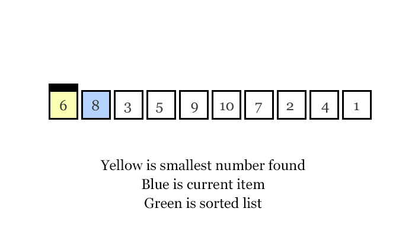
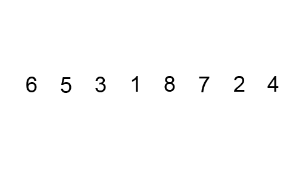

```
> #h1
> #h2
> ...
> *in đậm*
> **bôi đậm*
> ***in nghiêng và bôi đậm***
> `thêm code`
> [title](link//anh)
> gạch đầu dòng:
	> *
	> *
	> *
	> hoặc
	> 1.
	> 2.
	> 3.
> gạch kẻ ***
> highlight text >
> \
> {@youtube: Youtube ID or url}
```

## Các lý thuyết tổng hợp

**Độ phức tạp** là gì?
> Độ phức tạp thuật toán là định lượng tương đối thể hiện **số phép toán** của giải thuật so với kích thước của đầu vào.

**Độ ổn định(stable)** là gì?
> Độ ổn định của thuật toán là **đảm bảo thứ tự ban đầu** của dữ liệu đầu vào sau khi sắp xếp


Phân loại dựa trên **phương pháp**

* Cách tiếp cận ***chia để trị***: merge sort và quicksort
* Cách tiếp cận gia tăng việc sử dụng các ***vòng lặp lồng nhau***:  bucket sort, selection sort, insertion sort.
* Giải quyết vấn đề bằng cách sử dụng ***cấu trúc dữ liệu***: heapsort, tree sort
* Giải quyết vấn đề bằng cách sử dụng ***băm***: counting sort


***
## Giải thuật sắp xếp selectionsort
####1. Lý thuyết
> **Sắp xếp chọn** được tiến hành bằng cách **chia mảng thành hai phần**, **được sắp xếp** ở phía bên phải, và **chưa được sắp xếp** ở phía bên trái. 

> Sau mỗi lần chạy, **phần tử lớn nhất(hoặc bé nhất)** luôn **được đẩy về phía mảng đã sắp xếp**

####2. Minh họa

####3. Độ phức tạp
> Độ phức tạp thời gian của trường hợp **xấu nhất, trung bình và tốt nhất** đều là: **O (n * n)**. Vì giải thuật **luôn thực hiện quá trình lặp 2 mảng**.
####4. Code
```
* Thực hiện một vòng lặp tới vị trí gần cuối mảng(độ dài - 1)
* Đặt giá trị index vào vị trí đầu tiên của của lần lặp
* Thực hiện một vòng lặp từ vị trí tiếp theo đến cuối mảng
* Đặt giá trị index nếu giá trị hiện tại lớn hơn giá trị tại index
* Đảo nếu vị trí index và vị trí đầu tiên của lần lặp
```
```
void selectionSort(int arr[], int n)
{
    int i, j, min_idx;
    for (i = 0; i < n-1; i++)
	    min_idx = i;
	    for (j = i+1; j < n; j++)
	        if (arr[j] < arr[min_idx])
	        min_idx = j;
		swap(arr[min_idx], arr[i]);
}
```

***

## Giải thuật sắp xếp bubblesort
####1. Lý thuyết
> **Sắp xếp nổi bọt** được tiến hành dựa trên việc **so sánh cặp phần tử liền kề nhau và tráo đổi thứ tự** nếu chúng không theo thứ tự.

> Sau mỗi lần chạy, **phần tử lớn nhất luôn nổi lên trên tuần tự**.

####2. Minh họa



####3. Độ phức tạp
> Độ phức tạp thời gian của trường hợp **xấu nhất và trung bình**: **O (n * n)**. Trường hợp xấu nhất xảy ra **khi mảng được sắp xếp ngược lại**.

> Độ phức tạp về thời gian của trường hợp ***tốt nhất***: **O (n)**. Trường hợp tốt nhất xảy ra **khi mảng đã được sắp xếp**.

####4. Code
* thuật toán cơ bản
```
* Thực hiện một vòng lặp từ đầu đến cuối mảng
* Thực hiện một vòng lặp từ đầu đến vị trí i(độ dài - số vòng lặp)
* Thực hiện đảo phần tử nếu phần tử trước lớn hơn phần tử sau
```
```
void bubbleSort(int arr[], int lengthOfArr)  
{  
    int i, j;  
    for (i = 0; i < lengthOfArr-1; i++)
	    // Last i elements are already in place  
	    for (j = 0; j < lengthOfArr-i-1; j++)  
	        if (arr[j] > arr[j+1])  
	            swap(&arr[j], &arr[j+1]);  
} 
```
* thuật toán cải tiến
> Có thêm **biến bool kiểm tra**, nếu mảng đã tối ưu và **không xảy ra sự thay đổi** nào thì trực tiếp **ngắt ngay lần chạy thứ nhất**
```
void bubbleSort(int arr[], int n) 
{ 
   int i, j; 
   bool swapped; 
   for (i = 0; i < n-1; i++){ 
     swapped = false; 
     for (j = 0; j < n-i-1; j++){ 
        if (arr[j] > arr[j+1]){ 
           swap(&arr[j], &arr[j+1]); 
           swapped = true; 
        } 
     }
     if (swapped == false) 
        break; 
   } 
}
```
## Giải thuật sắp xếp insertionsort
####1. Lý thuyết
> **Sắp xếp chèn** là chèn một phần tử vào danh sách con đã qua sắp xếp. Phần tử được **chèn vào vị trí thích hợp** sao cho vẫn **đảm bảo danh sách con vẫn sắp theo thứ tự**.

> Danh sách đã sắp xếp ban đầu là rỗng và **danh sách lớn dần** và **tốc độ xử lý chậm dần**

####2. Minh họa


####3. Độ phức tạp

> Độ phức tạp thời gian của trường hợp **xấu nhất, trung bình: O(n\*n)**. Trường hợp xấu nhất xảy ra khi **sắp xếp mảng ngược** và phải so sánh từng phần tử.

> Độ phức tạp về thời gian của trường hợp tốt nhất : O (n). Trường hợp tốt nhất xảy ra khi mảng đã được sắp xếp khi **phần tử được duyệt ngay lần so sánh đầu tiên**.

####4. Code
```
* Chọn giá trị của phần tử đầu tiên là được sắp xếp
* Duyệt mảng từ phần tử thứ hai đến cuối 
* với mỗi phần tử là khóa và lưa địa chỉ hiện tại làm điểm neo
* Duyệt mảng ngược từ điểm neo về 0
* Bất cứ phần tử nào lớn hơn khóa thì đảo vị trí của khóa và phần tử đó
```
```
void insertionSort(int arr[], int n){
   int i, key, j;
   for (i = 1; i < n; i++){
       key = arr[i];
       j = i-1;
       while (j >= 0 && arr[j] > key){
           arr[j+1] = arr[j];
           j = j-1;
       }
       arr[j+1] = key;
   }
}
```
## giải thuật sắp xếp quicksort
####1. Lý thuyết
####2. Minh họa
####3. Độ phức tạp
####4. Code
## giải thuật sắp xếp heapsort 
####1. Lý thuyết
####2. Minh họa
####3. Độ phức tạp
####4. Code
## giải thuật sắp xếp trộn merge sort
####1. Lý thuyết
> **Sắp xếp trộn** được tiến hành dựa trên **chia nhỏ danh sách** cần sắp xếp **thành từng phần tử theo nguyên tắc** rồi sau đó **hòa nhập theo phương pháp trộn** tự nhiên thành dãy có thứ tự.

> Phù hợp với các bài toán có **dữ liệu lớn và phức tạp**. 

> **Phương pháp trộn phần tử** luôn **đảm bảo chuỗi con là một dãy tăng(giảm)**, sau đó **so sánh các phần tử đầu** để ghép vào chuỗi lớn hơn. Nếu chuỗi con này **rỗng thì lấy toàn bộ chuỗi kia**.

####2. Minh họa

####3. Độ phức tạp
> Độ phức tạp thời gian của trường hợp xấu nhất, trung bình, tốt nhất: O(nlog(n)). 
> Các phần tử luôn trải qua quá trình tách và ghép phần tử, tuy nhanh nhưng nhược điểm là thuật toán khó cài đặt

####4. Minh họa thuật toán trộn và code
```
Giả sử ta có 2 mảng con lần lượt là:
arr1[n1 = 4] = [1, 9, 10, 10] 
arr2[n2 = 4] = [3, 5, 7, 9]
sort_arr = []
Khởi tạo i = 0, j = 0 tương ứng là chỉ số bắt đầu của arr1 và arr2
nếu arr1[i] =< arr2[j]:
chèn arr1[i] vào đầu sort_arr và i+=1
nếu arr1[i] > arr2[j]:
chèn arr2[j] vào đầu sort_arr và j+=1
nếu i == n1 (tương ứng arr1 xếp xong)
chèn arr1[j] còn lại vào sort_arr, kết thúc quá trình xếp
nếu j == n2 (tương ứng arr2 xếp xong)
chèn arr2[i] còn lại vào sort_arr, kết thúc quá trình xếp
```
```
// Gộp hai mảng con arr[l...m] và arr[m+1..r]
void merge(int arr[], int l, int m, int r)
{
    int i, j, k;
    int n1 = m - l + 1;
    int n2 =  r - m;
    /* Tạo các mảng tạm */
    int L[n1], R[n2]; 
    /* Copy dữ liệu sang các mảng tạm */
    for (i = 0; i < n1; i++)
        L[i] = arr[l + i];
    for (j = 0; j < n2; j++)
        R[j] = arr[m + 1+ j]; 
    /* Gộp hai mảng tạm vừa rồi vào mảng arr*/
    i = 0; // Khởi tạo chỉ số bắt đầu của mảng con đầu tiên
    j = 0; // Khởi tạo chỉ số bắt đầu của mảng con thứ hai
    k = l; // Khởi tạo chỉ số bắt đầu của mảng lưu kết quả
    while (i < n1 && j < n2){
        if (L[i] <= R[j]){
            arr[k] = L[i];
            i++;
        }
        else{
            arr[k] = R[j];
            j++;
        }
        k++;
    }
    /* Copy các phần tử còn lại của mảng L vào arr nếu có */
    while (i < n1)
    {
        arr[k] = L[i];
        i++;
        k++;
    }
    /* Copy các phần tử còn lại của mảng R vào arr nếu có */
    while (j < n2)
    {
        arr[k] = R[j];
        j++;
        k++;
    }
}
```
####5. Code
```
void merge(int arr[], int l, int m, int r){}
void mergeSort(int arr[], int l, int r){
    if (l < r)    {
        // Tương tự (l+r)/2, nhưng cách này tránh tràn số khi l và r lớn
        int m = l+(r-l)/2;
        // Gọi hàm đệ quy tiếp tục chia đôi từng nửa mảng
        mergeSort(arr, l, m);
        mergeSort(arr, m+1, r);
        // Hàm đệ quy tương tự để ghép từng nửa mảng
        merge(arr, l, m, r);
    }
}
```
## bài toán sắp xếp và tìm kiếm tuần tự, tìm kiếm nhị phân
####1. Lý thuyết
####2. Minh họa
####3. Độ phức tạp
####4. Code
## cây nhị phân tìm kiếm
####1. Lý thuyết
####2. Minh họa
####3. Độ phức tạp
####4. Code

***
##Đọc thêm
***
## cấu trúc dữ liệu biểu diễn danh sách(ngăn xếp và hàng đợi)
####1. Lý thuyết
####2. Minh họa
####3. Độ phức tạp
####4. Code
## cây nhị phân và ứng dụng
####1. Lý thuyết
####2. Minh họa
####3. Độ phức tạp
####4. Code
## giải thuật sắp xếp shellsort
####1. Lý thuyết
####2. Minh họa
####3. Độ phức tạp
####4. Code
## giải thuật sắp xếp bằng cơ chế radix sort
####1. Lý thuyết
####2. Minh họa
####3. Độ phức tạp
####4. Code
## cây tìm kiếm cơ số radix search tree
####1. Lý thuyết
####2. Minh họa
####3. Độ phức tạp
####4. Code
## cây tìm kiếm số học digtal search tree
####1. Lý thuyết
####2. Minh họa
####3. Độ phức tạp
####4. Code
